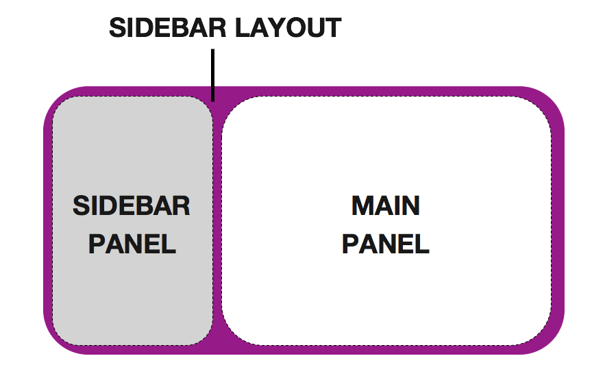

```{r setup, include=FALSE}
knitr::opts_chunk$set(echo = TRUE)
```

# WHAT IS R-SHINY?

<br/>

- A tool that enables R scripts to turn into interactive web applications


- 2 main components:

  - User Interface
  - Server
---
background-image: url(images/04_RLadiesVan-logo.jpg)
background-size: 400px
background-position: 100% 50%
class: left, middle

# MINI CHALLENGE #1

- Create a plot with the gapminder dataset
  - `life expectancy` vs `year`
  - `population` vs `year`
  - etc.
---

```{r, fig.height=4, dev='svg'}
library(gapminder)
library(ggplot2)

ggplot(data = gapminder,
       aes(x = lifeExp, y = gdpPercap, colour = continent)) + 
  geom_point(size = 1) +
  labs(x = "Life Expectancy", y = "GDP per capita",
       title = "GDP per capita vs Life Expectancy") + 
  scale_y_log10() + theme_bw()
```


---

# A VERY BASIC SHINY APP

- Make sure you have the `shiny` package installed

```{r, eval=FALSE}
install.packages("shiny")
```

```{r, eval=FALSE}
library(shiny) #load the package

ui <- fluidPage("Hello World") # user interface

server <- function(input, output) {} # the server

shinyApp(ui = ui, server = server) # launch the app
```

# FINAL GOAL FOR THE WORKSHOP

💜💜[Shiny App with Gapminder Dataset](https://ace8.shinyapps.io/test/)💜💜

---
background-image: url(images/04_RLadiesVan-logo.jpg)
background-size: 400px
background-position: 100% 50%
class: left, middle

# MINI CHALLENGE #2


- Create a local folder

- Create an R script and name it `app.R`

- Create your own "very basic" app

- Make sure your simple app runs

---

# THE LAYOUT

.pull-left[
```{r, eval=FALSE}
library(shiny)

ui <- fluidPage(
  sidebarLayout( #<<
    sidebarPanel( #<<
      # Input() functions #<<
    ),  #<<
    mainPanel( #<<
      # Output() functions #<<
    )  #<<
  )  #<<
)

server <- function(input, output) {}

shinyApp(ui = ui, server = server)
```
]

.pull-right[




]

---

# INPUTS

<br/>

```{r, eval=FALSE}
library(shiny)

ui <- fluidPage(
  
  sliderInput(inputId = "num", #<<
              label = "Choose a number",#<<
              value = 25, min = 1, max = 100),#<<
  
)

server <- function(input, output) {}

shinyApp(ui = ui, server = server)
```

For help: `?sliderInput`

---

# INPUT FUNCTIONS


---
background-image: url(images/04_RLadiesVan-logo.jpg)
background-size: 400px
background-position: 100% 50%
class: left, middle

# MINI CHALLENGE #3

Add a `sliderInput()` variable that enables users  
to select a different period in time

**Bonus:**

Add a `RadioButtons()` variable that  
presents `pop`, `lifeExp` and `gdpPercap`   
as options to select from  

---

<br/>
<br/>

```{r, eval=FALSE}
ui <- fluidPage(
   titlePanel("Gapminder"),

   sidebarLayout(
      sidebarPanel( 
        
        sliderInput("Year",   #<<
                    label = h5("Range of years:"),#<<
                    min = 1952,#<<
                    max = 2007,#<<
                    value = c(1952, 2007), #<<
                    step = 5#<<
                    ),#<<
         
         radioButtons("Variable", #<<
                      label = h5("Select Variable"),#<<
                      choices = c("Population" = "pop",#<<
                                  "Life Expectancy" = "lifeExp",#<<
                                  "GDP Per Capita" = "gdpPercap")#<<
                      )#<<
      ),
      
      mainPanel()
   )
)
```


---

# OUTPUTS

<br/>

```{r, eval=FALSE}
library(shiny)

ui <- fluidPage(
  
  sliderInput(inputId = "num",
              label = "Choose a number",
              value = 25, min = 1, max = 100),
  
  plotOutput("hist") #<<
  
)

server <- function(input, output) {}

shinyApp(ui = ui, server = server)
```

---

```{r, eval=FALSE}
ui <- fluidPage(
   titlePanel("Gapminder"),

   sidebarLayout(
      sidebarPanel( 
        
        sliderInput("Year",   
                    label = h5("Range of years:"),
                    min = 1952,
                    max = 2007,
                    value = c(1952, 2007),
                    step = 5
                    ),
         
         radioButtons("Variable",
                      label = h5("Select Variable"),
                      choices = c("Population" = "pop",
                                  "Life Expectancy" = "lifeExp",
                                  "GDP Per Capita" = "gdpPercap")
                      )
      ),
      
      mainPanel(
         plotOutput("GapminderPlot"), #<<
         tableOutput("GapminderTable") #<<
      )
   )
)
```

---

# SERVER

- Assemble inputs into outputs

1) Save objects to display to output$
  
```{r, eval=FALSE}
server <- function(input, output) {
  output$hist <- #code
}
```
  
2) Build objects to display with render*()
  
  - `render*()` functions --> build reactive output to display in UI
  
3) Use input values with `input$*`
  

---
background-image: url(images/04_RLadiesVan-logo.jpg)
background-size: 400px
background-position: 100% 50%
class: left, middle

# CHALLENGES NEVER END!

- [RStudio Tutorials](https://shiny.rstudio.com/tutorial/) 

- Here are some examples:
