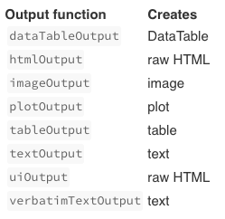

```{r setup, include=FALSE}
knitr::opts_chunk$set(echo = TRUE)
```

<link href="https://afeld.github.io/emoji-css/emoji.css" rel="stylesheet">

# WHAT IS R-SHINY?

<br/>

- A tool that enables R scripts to turn into interactive web applications


- 2 main components:

  - User Interface (`ui`)
  - Server (`server`)
---
background-image: url(images/04_RLadiesVan-logo.jpg)
background-size: 400px
background-position: 100% 50%
class: left, middle

# MINI CHALLENGE #1

- Create a plot with the gapminder dataset
  - `lifeExp` vs `gpdPercap`
  - `pop` vs `year`
  - `lifeExp` vs `year`
  - etc.
---

# POSSIBLE SOLUTION TO #1

```{r, fig.height=3, dev='svg'}
library(gapminder)
library(ggplot2)

ggplot(data = gapminder,
       aes(x = lifeExp, y = gdpPercap, colour = continent)) + 
  geom_point(size = 1) +
  labs(x = "Life Expectancy", y = "GDP per capita",
       title = "GDP per capita vs Life Expectancy") + 
  scale_y_log10() + theme_bw()
```


---

# A VERY BASIC SHINY APP

- Make sure you have the `shiny` package installed 

```{r, eval=FALSE}
install.packages("shiny")
```

```{r, eval=FALSE}
library(shiny) #load the package

ui <- fluidPage("Hello World") # user interface

server <- function(input, output) {} # the server

shinyApp(ui = ui, server = server) # launch the app
```

# FINAL GOAL FOR THE WORKSHOP

💜💜[Shiny App with Gapminder Dataset](https://ace8.shinyapps.io/test/)💜💜

---

background-image: url(images/04_RLadiesVan-logo.jpg)
background-size: 400px
background-position: 100% 50%
class: left, middle

# MINI CHALLENGE #2


- Create a local folder

- Create an R script file and name it `app.R`

- Create your own "very basic" app

- Make sure your simple app runs  
**Hint:** Select all and hit `Run`

---

# THE LAYOUT

.pull-left[

```{r, eval=FALSE}
library(shiny)

ui <- fluidPage(
  titlePanel(), #<<
  sidebarLayout( #<<
    sidebarPanel( #<<
      # Input() functions #<<
    ),  #<<
    mainPanel( #<<
      # Output() functions #<<
    )  #<<
  )  #<<
)

server <- function(input, output) {}

shinyApp(ui = ui, server = server)
```
]

.pull-right[


]

---

# `ui`: INPUTS

<br/>

```{r, eval=FALSE}
library(shiny)

ui <- fluidPage(
  
  sliderInput(inputId = "num", #<<
              label = "Choose a number",#<<
              value = 25, min = 1, max = 100),#<<
  
)

server <- function(input, output) {}

shinyApp(ui = ui, server = server)
```

For help: `?sliderInput`

---

# INPUT FUNCTIONS


---
background-image: url(images/04_RLadiesVan-logo.jpg)
background-size: 400px
background-position: 100% 50%
class: left, middle

# MINI CHALLENGE #3

Add a `sliderInput()` variable that enables users  
to select a different period in time

**Bonus:**

Add a `RadioButtons()` variable that  
presents `pop`, `lifeExp` and `gdpPercap`   
as options to select from  

---

# POSSIBLE SOLUTION TO #3 

```{r, eval=FALSE}
ui <- fluidPage(
   titlePanel("Gapminder"), #<<

   sidebarLayout(
      sidebarPanel( 
        sliderInput("Year",   #<<
                    label = h5("Range of years:"),#<<
                    min = 1952,#<<
                    max = 2007,#<<
                    value = c(1952, 2007), #<<
                    step = 5#<<
                    ),#<<
         
         radioButtons("Variable", #<<
                      label = h5("Select Variable"),#<<
                      choices = c("Population" = "pop",#<<
                                  "Life Expectancy" = "lifeExp",#<<
                                  "GDP Per Capita" = "gdpPercap")#<<
                      )#<<
      ),
      mainPanel()
   )
)
```
---

# `ui`: OUTPUTS

```{r, eval=FALSE}
ui <- fluidPage(
  sliderInput(inputId = "num",
              label = "Choose a number",
              value = 25, min = 1, max = 100),
  
  plotOutput("hist") #<<
)
```

### Some other output functions:



---

```{r, eval=FALSE}
ui <- fluidPage(
   titlePanel("Gapminder"),

   sidebarLayout(
      sidebarPanel( 
        
        sliderInput("Year",   
                    label = h5("Range of years:"),
                    min = 1952,
                    max = 2007,
                    value = c(1952, 2007),
                    step = 5
                    ),
         
         radioButtons("Variable",
                      label = h5("Select Variable"),
                      choices = c("Population" = "pop",
                                  "Life Expectancy" = "lifeExp",
                                  "GDP Per Capita" = "gdpPercap")
                      )
      ),
      mainPanel(
         plotOutput("GapminderPlot"), #<<
         tableOutput("GapminderTable") #<<
      )
   )
)
```

---

# SERVER

- Assemble inputs into outputs

- Follow 3 steps for interactive plots:

  1) Save objects to display to `output$`  
  2) Build objects to display with `render*()`  
  3) Use input values with `input$*`
  
<br/>
  
```{r, eval=FALSE}
server <- function(input, output) {
  output$hist <- renderPlot({ #<<
    hist(rnorm(input$num), main = "Normal Distribution") #<<
  })
}
```
  
---
background-image: url(images/04_RLadiesVan-logo.jpg)
background-size: 400px
background-position: 100% 50%
class: left, middle

# MINI CHALLENGE #4

- Create a plot in the Gapminder app that would  
use the variable chosen in the `RadioButtons()`  
and plot it against `year`

### Bonus:  

- Build interactivity based on the `year` range  
selected in the slider

---

# POSSIBLE SOLUTION TO #4

```{r, eval=FALSE}
server <- function(input, output) {
   
   output$GapminderPlot <- renderPlot({ #<<
    dat %>% filter(year >= min(input$Year) & year <= max(input$Year)) %>% #<<
     ggplot(aes_string(x = "year",y = input$Variable,colour = "country")) + #<<
       geom_line(size = 1) + #<<
       xlab("Year") + #<<
       labs(title = (paste0("US - CANADA ", input$Variable, #<<
                            " comparison between ", min(input$Year), #<<
                            "-", max(input$Year)))) + #<<
       ylab(aes_string(input$Varible)) + theme_bw() #<<
   }) #<<
   
   output$GapminderTable <- renderTable({ 
     data <- dat %>% filter(year >= min(input$Year) & year <= max(input$Year)) 
   })
}
```

---
background-image: url(images/04_RLadiesVan-logo.jpg)
background-size: 400px
background-position: 100% 50%
class: left, middle

# CHALLENGES NEVER END!

- [RStudio Tutorials](https://shiny.rstudio.com/tutorial/)

- For more Shiny app examples see  
these `github` repositories:

  - [Gapminder](https://akshi8.shinyapps.io/Gapminder/) <i class="em em-blue_heart"></i>  
  source code [here](https://github.com/akshi8/Gapminder/blob/master/Gapminder/app.R)
    
  - [US Crime Statistics](https://akshi8.shinyapps.io/US_Crime_Report/) <i class="em em-orange_heart"></i>  
  source code [here](https://github.com/akshi8/US_Crime_Report/blob/master/code/app.R)
  
  - [The Noble Grapes](https://charcarriero.shinyapps.io/noble-grapes/) <i class="em em-green_heart"></i>  
  source code [here](https://github.com/charcarr/shiny-wine/blob/master/noble-grapes/app.R)
  
  - [Marshall Crime Data Analysis](https://simranubc.shinyapps.io/Marshall-crime-analysis/) <i class="em em-purple_heart"></i>  
  source code [here](https://github.com/simrnsethi/marshall-crime-analysis)
  
  - [Redistricting through Machine Learning](https://indiana-nikel.shinyapps.io/gerrymandering_app/) <i class="em em-heart"></i>  
  source code [here](https://github.com/indiana-nikel/gerrymandering/tree/master/application/gerrymandering_app)
