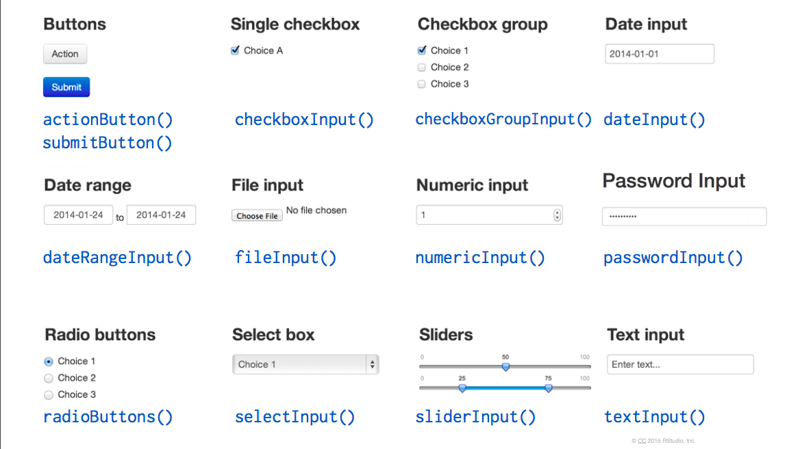

```{r setup, include=FALSE}
knitr::opts_chunk$set(echo = TRUE, eval=FALSE)
```
background-image: url(images/04_RLadiesVan-logo.jpg)
background-size: 150px
background-position: 100% 0%

# WHAT IS R-SHINY?

<br/>

- Tool that enables R scripts to turn into interactive web applications


- 2 main components:

  - User Interface
  - Server

---
background-image: url(images/04_RLadiesVan-logo.jpg)
background-size: 150px
background-position: 100% 0%

# STRUCTURE OF AN R-SHINY APP

---
background-image: url(images/04_RLadiesVan-logo.jpg)
background-size: 150px
background-position: 100% 0%

# A VERY BASIC SHINY APP

<br/>

```{r}
install.packages("shiny")
```


```{r}
library(shiny) #load the package

ui <- fluidPage("Hello World") # user interface

server <- function(input, output) {} # the server

shinyApp(ui = ui, server = server) # launch the app
```


---
background-image: url(images/04_RLadiesVan-logo.jpg)
background-size: 150px
background-position: 100% 0%

# INPUTS

<br/>

```{r, eval=FALSE}
ui <- fluidPage(
 # Input() functions,
 # Output() functions
)
```


---
background-image: url(images/04_RLadiesVan-logo.jpg)
background-size: 150px
background-position: 100% 0%

# INPUT: `sliderInput()`

<br/>

```{r, eval=FALSE}
ui <- fluidPage(
  sliderInput(inputId = "num", #<<
              label = "Choose a number", #<<
              value = 25, min = 1, max = 100) #<<
)
```

- `?sliderInput`


---
background-image: url(images/04_RLadiesVan-logo.jpg)
background-size: 150px
background-position: 100% 0%

# OTHER INPUT FUNCTIONS




---
background-image: url(images/04_RLadiesVan-logo.jpg)
background-size: 150px
background-position: 100% 0%

# INPUTS AND OUTPUTS

<br/>

```{r, eval=FALSE}
library(shiny) #load the package

ui <- fluidPage(
  sliderInput(inputId = "num",
              label = "Choose a number",
              value = 25, min = 1, max = 100),
  
  plotOutput("hist")
  
) # user interface

server <- function(input, output) {} # the server

shinyApp(ui = ui, server = server) # launch the app
```


---
background-image: url(images/04_RLadiesVan-logo.jpg)
background-size: 150px
background-position: 100% 0%

# SERVER

- Assemble inputs into outputs

1) Save objects to display to output$
  
```{r, eval=FALSE}
server <- function(input, output) {
  output$hist <- #code
}
```
  
2) Build objects to display with render*()
  
  - `render*()` functions --> build reactive output to display in UI
  
3) Use input values with `input$*`
  

---
background-image: url(images/04_RLadiesVan-logo.jpg)
background-size: 150px
background-position: 100% 0%

# WHERE TO GO NEXT?

- [RStudio Tutorials](https://shiny.rstudio.com/tutorial/)
