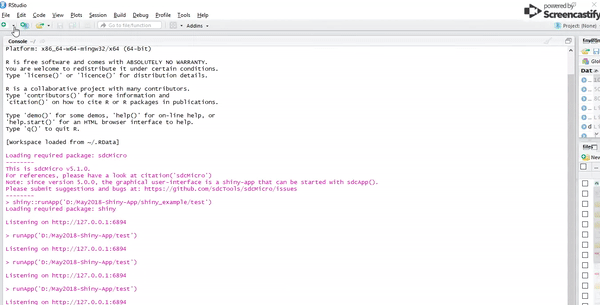

# Launching and Publishing Shiny App

* Starting a shiny project and launching the App in browser
  - By selecting a new shiny WebApp option in Rstudio an example app will open which can be modified to create a custom Web App
  - use the `Run App` button to launch the App

  

* Publishing and deploying shiny app on shiny server
  - Click on the blue - Publish icon next to Rstudio to launch the shiny server prompt.

  
